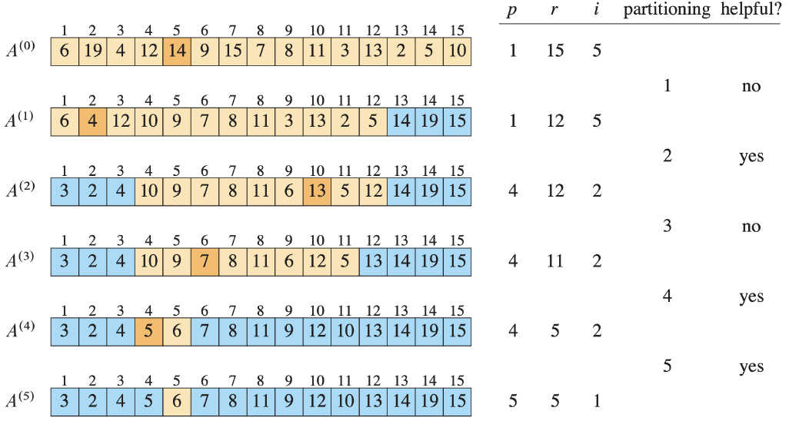

# selection algorithm

## 1. select k번째 element: Random Partition

### 1) 문제/목표: 무엇을 계산? 입력/출력 명세

- 입력: 배열 A, 정수 k($1 \leq n$) - k번째 순서통계량(작은 것부터 k번째)
- 출력: A의 k번째 원소 값
- 전제: 비교연산 가능, 제자기(partition) 가능

### 2) 아이디어 한 줄: 핵심 직관(분할-정복/그리디/DP 등)

- QuickSort의 파티션을 이용해 필요한 한쪽만 재귀

### 3) 의사코드(5~15줄): 핵심만



```
RANDOMIZED-SELECT(A, p, r, i):
    if p == r:
        return A[p]

    q = RANDOMIZED-PARTITION(A, p, r)
    k = q - p + 1

    if i == k:
        return A[q]
    else if i < k:
        return RANDOMIZED-SELECT(A, p, q-1, i)
    else return RANDOMIZED-SELECT(A, q+1, r, i-k)
```

-

### 4) 정확성 스케치: 루프 불변식/귀납 증명 요지 3줄

- 피벗은 분할 후 정확히 자신의 순위가 확정됨.
- k는 피벗 좌/우 중 정확히 한 쪽에만 존재 → 불변식: “k번째 원소는 탐색 중인 부분배열 안에 있다.”
- 귀납적으로 한 단계씩 줄어 최종적으로 k번째 원소를 반환

### 5) 복잡도: T(n) 점화식 → 해, 공간복잡도

- 기대 pruning 계산

  - pivot이 j일 때 남는 원소 수:
    - j = k -> 0
    - j < k -> n-j
    - j > k -> j-1
  - 기대 남는 원소 수:
    $E[remain] = {n\over 1}(sum _{j=1} ^{k-1} (n-j)`+`0`+` sum _{j=k+1} ^{n} (j-1))$
  - 기대 pruning 수:
    $E[pruned] = n - E[remain]$

- 특수 케이스 기대값:

  - k=1 (최솟값): 평균 남음 = $2\over n$
  - k=n (최댓값): 평균 남음 = $2\over n$
  - k=$2\over n$ (중앙값): 평균 남음 = $4\over 3n$

- 점화식:

  - 평균적으로 T(n) = T($4\over 3n$) + Θ(n) = T($4\over 3n$) + n = 4n
  - 해: 기대 Θ(n), 실제 약 4n

- Worst Case: Θ(n²) (매번 최악의 피벗 선택 시)

- 공간: O(1) (제자리 파티션), O(log n) (재귀 깊이 기대).

### 6) 함정/엣지케이스: 3가지

-

### 7) 연결 개념: 함께 보면 좋은 개념(예: 안정정렬, 하한)

- QuickSort와의 관계 (분할 → 양쪽 다 재귀 vs 한쪽만).
- 안정 정렬은 아님 (순서 유지 X).
