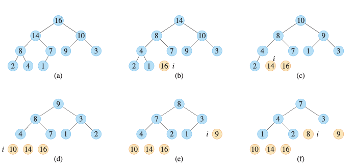

# sort algorithm


## 1. heap sort

### 1) 문제/목표: 무엇을 계산? 입력/출력 명세

- 입력: 길이 n의 배열 A[1:n]
- 출력: 오름차순으로 정렬된 A

### 2) 아이디어 한 줄: 핵심 직관(분할-정복/그리디/DP 등)

- 완전 이진 트리
- 항상 부모 >= 자식
- 배열을 max-heap으로 만든 뒤, 루트(최대값)를 맨 끝과 교환 -> 힙 크기를 줄이며 아래로 내리면서 보정을 반복

### 3) 의사코드(5~15줄): 핵심만



```
Heap-Sort(A, n):
    Build-Max-Heap(A, n)
    for i=n to 2:
        swap A[1], A[i]
        A.heap-size = A.heap-size - 1
        Max-Heapify(A, 1)
```

- 내림차순이면 최소 힙을 쓰거나 비교 부호를 반대로 두면 됨.

### 4) 정확성 스케치: 루프 불변식/귀납 증명 요지 3줄

- BUILD-MAX-HEAP 후 `A[1...n]`는 힙 속성을 만족(부모 ≥ 자식).
- 메인 루프 각 반복 끝에
  1. `A[i..n]`는 오름차순으로 확정되어 있고,
  2. `A[1..i]`는 여전히 최대 힙입니다(MAX-HEAPIFY로 복원).
- `i=2`에서 종료하면 전체가 정렬.

### 5) 복잡도: T(n) 점화식 → 해, 공간복잡도

- `Build-Max-Heap`: O(n) (노드 높이의 합을 이용한 증명)
- 추출 반복: $n-1회 * `heapify` O(logn) -> 전체 O(nlogn)$
- 공간: O(1) (제자리)

### 6) 함정/엣지케이스: 3가지

### 7) 연결 개념: 함께 보면 좋은 개념(예: 안정정렬, 하한)
