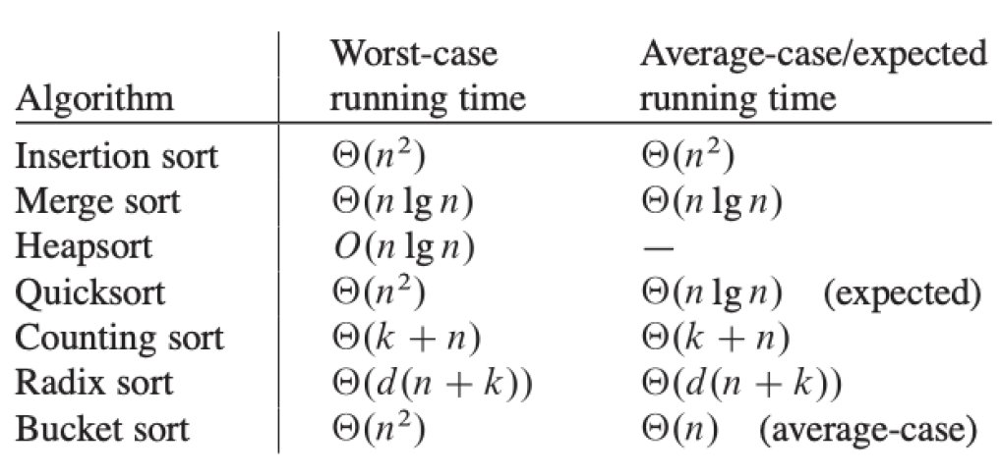
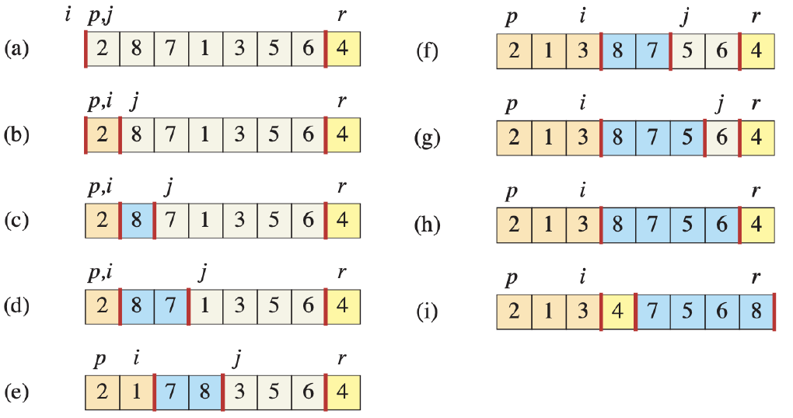

### sort algorithm



## 1. quick sort

# 1) 문제/목표: 무엇을 계산? 입력/출력 명세

- 입력: 길이가 n인 배열 A[1:n]
- 출력: 오름차순으로 정렬된 배열 A

# 2) 아이디어 한 줄: 핵심 직관(분할-정복/그리디/DP 등)

- 분할-정복: 한 원소를 피벗으로 고르고, 피벗보다 작은 구간/ 같은 구간/ 큰 구간으로 분할(partition) 한 뒤, 피벗 제외 구간만 재귀 정렬.

# 3) 의사코드(5~15줄): 핵심만



```
Quick-Sort(A, p, r):
    if p < r:
        q = Partition(A, p, r)
        Quick-Sort(A, p, q-1)
        Quick-Sort(A, q+1, r)
```

```
PARTITION(A, p, r):
    x ← A[r]              // pivot
    i ← p - 1
    for j ← p to r-1:
        if A[j] < x:
            i ← i + 1
            swap A[i], A[j]
    swap A[i+1], A[r]
    return i + 1
```

# 4) 정확성 스케치: 루프 불변식/귀납 증명 요지 3줄

- 분할 루프의 불변식: 반복 중 항상 “왼쪽은 < pivot, 가운데는 = pivot, 오른쪽은 > pivot”의 구간 불변을 유지.
- 분할 종료 후 피벗(들)을 제외한 양쪽 구간에 재귀 정렬을 적용하면 전체 정렬이 완성(귀납).

# 5) 복잡도: T(n) 점화식 → 해, 공간복잡도

- 평균/기대: O(nlogn) (무작위 피벗 또는 좋은 피벗 선택)
- 최선: 균등 분할이면 O(nlogn)
- 최악: 이미 정렬된 입력에서 나쁜 피벗(끝 요소 등) -> $O(n^2)$
- 공간: 제자리.

# 6) 함정/엣지케이스: 3가지

# 7) 연결 개념: 함께 보면 좋은 개념(예: 안정정렬, 하한)
