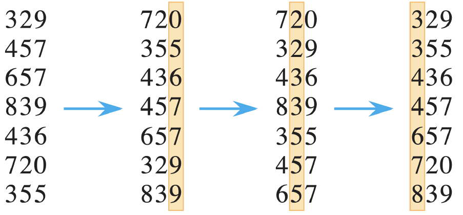

# sort algorithm


## 1. radix sort

### 1) 문제/목표: 무엇을 계산? 입력/출력 명세

- 입력: 길이가 n인 배열 A[1:n], 각 원소의 키가 정수(또는 고정 자릿수 문자열)
- 출력: 오름차순으로 정렬된 배열 A
- 전제: 자릿수 수 d, 기수(버킷 수) b가 주어질 때 안정적인(stable) 서브정렬을 자릿수 마다 적용

### 2) 아이디어 한 줄: 핵심 직관(분할-정복/그리디/DP 등)

- 자릿수별로 가장 하위 자릿수(LSD)부터 안정 정렬을 반복하면, 전체 키가 정렬됨
  - LSD(권장: 정수, 가변 길이 숫자): 1의 자리 -> 10의 자리 -> ... 순서
  - MSD(권장: 문자열, 고정 길이 키): 가장 앞자리 -> ...(부분배열을 재귀적으로 분기..?)

### 3) 의사코드(5~15줄): 핵심만



```
Radix-Sort(A, n, d):
    for i = 1 to d:
        use a stable sort to sort array A[1:n] on digit i
```

### 4) 정확성 스케치: 루프 불변식/귀납 증명 요지 3줄

- 각 패스에서 안정 정렬을 사용하면, 이전 자릿수(더 하위/상위)에서 형성된 상대 순서가 보존됩니다.
- LSD: 가장 낮은 자릿수부터 차례로 정렬하면 최종적으로 전체 키 순서가 완성됩니다(귀납).
- MSD: 상위 자릿수로 버킷을 분할한 뒤 각 버킷 내부를 재귀 정렬하면 전체가 정렬됩니다.

### 5) 복잡도: T(n) 점화식 → 해, 공간복잡도

- 시간: $O(d*(n+b))$
  - 정수 키 최대값 K에 대해 $d=⌈logb​(K+1)⌉$
- 공간: O(n+b) (출력 버퍼 + 카운트 배열 )

### 6) 함정/엣지케이스: 3가지

- 안정 정렬 필수: 서브정렬이 불안정하면 Radix의 전제 붕괴.

### 7) 연결 개념: 함께 보면 좋은 개념(예: 안정정렬, 하한)

- Counting Sort(안정) 필수 부품
- Bucket Sort(분포 가정)과 비교
