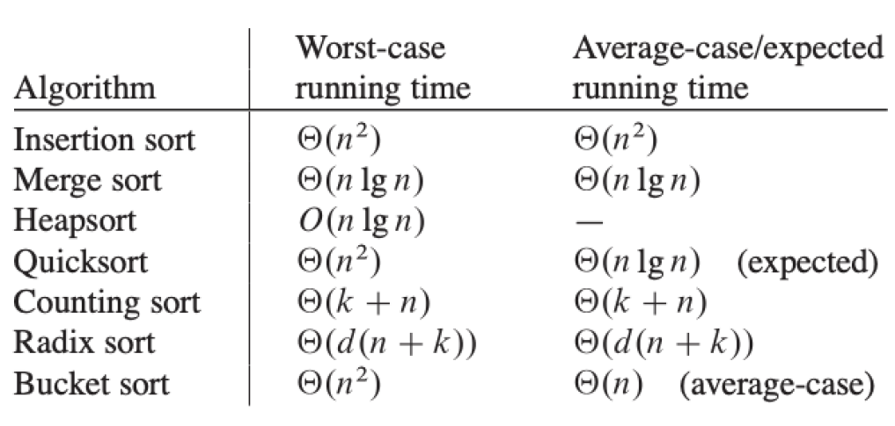
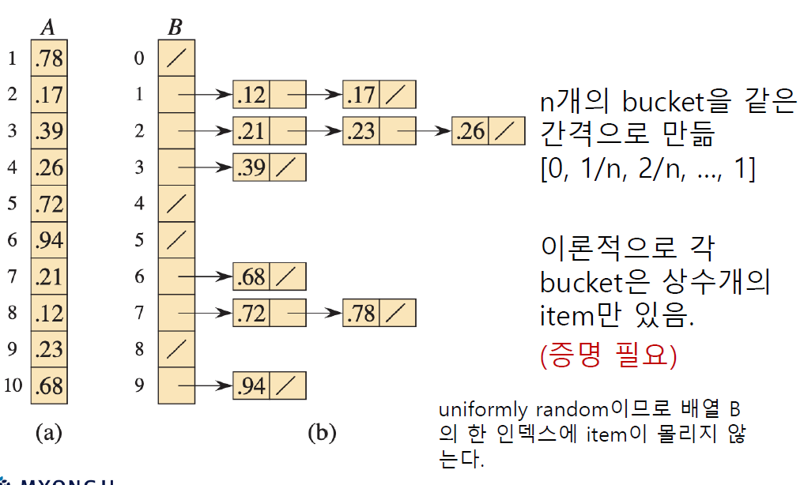

# sort algorithm



## 1. bucket sort

### 1) 문제/목표: 무엇을 계산? 입력/출력 명세

- 입력: 길이가 n인 배열 A[1:n], 각 원소의 키가 실수/정수 범위에 존재
- 출력: 오름차순으로 정렬된 배열 A
- 전제: 키들이 비슷하게 퍼져 있음(대략 균등 분포) -> 각 버킷에 원소 수가 작도록

### 2) 아이디어 한 줄: 핵심 직관(분할-정복/그리디/DP 등)

- 키의 범위를 $m$개의 버킷으로 나누어 분배(distribution) -> 각 버킷을 안정 정렬(보통 Insertion Sort) -> 버킷 순서대로 이어붙이기

### 3) 의사코드(5~15줄): 핵심만



실수 [0,1) 범위

```
Bucket-Sort(A, n):
    let B[0:n-1] be a new array
    for i = 0 to n-1:
        make B[i] an empty list

    for i = 1 to n:
        insert A[i] into list B[⌊n*A[i]⌋]

    for i = 0 to n-1
        sort list B[i] with insertion sort

    concatenate the lists B[0], B[1], ..., B[n-1] together in order

    return the concatenated lists
```

### 4) 정확성 스케치: 루프 불변식/귀납 증명 요지 3줄

- 분배: 모든 원소가 정확히 하나의 버킷에 들어간다(분할).
- 버킷 내부를 안정 정렬하면 각 버킷은 정렬.
- 버킷 인덱스가 작은 쪽이 항상 작은 구간을 대표하므로, 버킷들을 순서대로 이어붙이면 전체 정렬.

### 5) 복잡도: T(n) 점화식 → 해, 공간복잡도

- 기대 시간: $O(n+m)$ (균등 분포 가정) + 각 버킷 정렬 비용
  - Insertion Sort 사용 시 기대 O(n) (각 버킷 평균 크기 작음)
- 최악 시간: 한 버킷에 n개 몰리면 $O(n^2)$
- 공간: $O(n+m)$ (버킷 리스트 총합 + 포인터/헤더)

### 6) 함정/엣지케이스: 3가지

- 분포가 치우친 데이터: 한 버킷에 몰려 최악 $O(n^2)$ → 버킷 수/경계 재설계 or 다른 정렬(Quick/Merge) 고려.

### 7) 연결 개념: 함께 보면 좋은 개념(예: 안정정렬, 하한)

- Counting Sort와 비교: Counting은 정수 키 범위가 작을 때 유리, Bucket은 실수/연속값·분포 가정에 의존.
- Radix Sort와 비교: Radix는 자릿수 기반, Bucket은 값 구간 기반.
